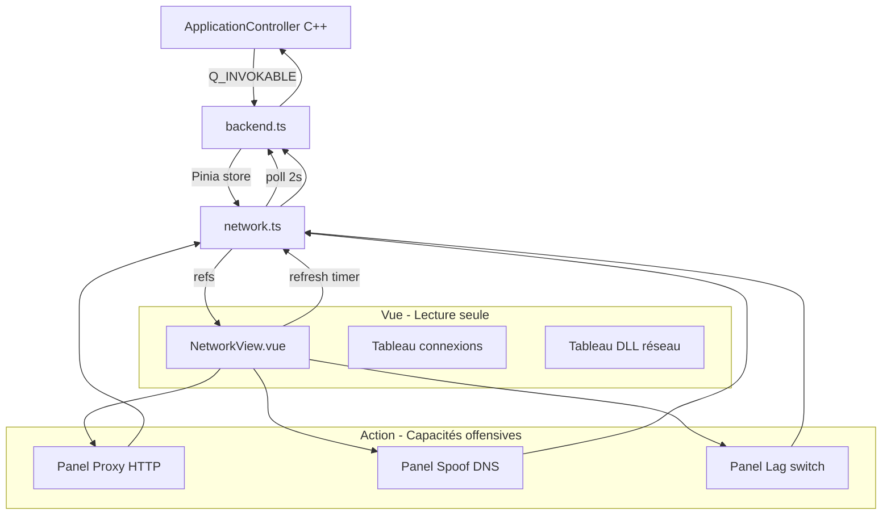

# Plan : NetworkView — Vue unifiée + Capacités offensives

**Date** : 2026-09-05  
**Statut** : Proposition  
**Scope** : Processus attaché uniquement

---

## Objectif produit

Offrir dans `NetworkView.vue` une vue réseau complète en **2 sections distinctes** :

### Section A — Vue (lecture seule, risque nul)
1. **Connexions actives** (TCP/UDP) — IPs distantes, ports, états, résolution DNS
2. **Modules DLL réseau chargés** — quelles bibliothèques réseau le process utilise

### Section B — Action (risque élevé, UAC/injection requis)
3. **Proxy HTTP** — Intercepter et modifier les requêtes/réponses HTTP du jeu
4. **Spoof DNS** — Rediriger un domaine vers localhost pour tester le mode offline
5. **Lag switch** — Retarder artificiellement le trafic réseau du process

---

## Architecture



---

## 1. Backend C++ — Nouvelles méthodes `Q_INVOKABLE`

### 1.1 `getProcessNetworkConnections()` — Lecture seule

**Signature** :
```cpp
Q_INVOKABLE QVariantMap getProcessNetworkConnections();
```

**Retour** :
```json
{
  "success": true,
  "connections": [
    {
      "protocol": "TCP",
      "localAddr": "192.168.1.10:49832",
      "remoteAddr": "52.14.88.23:443",
      "remoteHost": "matchmaking.steamserver.net",
      "state": "ESTABLISHED",
      "pid": 12345
    }
  ],
  "error": null
}
```

**Implémentation** :
- `GetExtendedTcpTable` + `GetExtendedUdpTable`
- Filtrer par `m_pid`
- Mapper les états TCP
- **Résolution DNS** : `getnameinfo()` en `std::async` avec timeout 500ms, cache LRU 256 entrées / TTL 60s

### 1.2 `getProcessNetworkModules()` — Lecture seule

**Signature** :
```cpp
Q_INVOKABLE QVariantMap getProcessNetworkModules();
```

**Retour** :
```json
{
  "success": true,
  "modules": [
    {
      "name": "ws2_32.dll",
      "path": "C:\\Windows\\System32\\ws2_32.dll",
      "category": "winsock",
      "description": "Windows Socket 2 API"
    }
  ],
  "error": null
}
```

**Implémentation** :
- `EnumProcessModules` + `GetModuleFileNameEx`
- Filtrer sur la liste des DLL réseau connues (~12 DLL)

### 1.3 `startHttpProxy(options)` — Action (injection)

**Signature** :
```cpp
Q_INVOKABLE QVariantMap startHttpProxy(int port, bool interceptHttps);
```

**Objectif** : Lancer un proxy HTTP local sur le port spécifié qui intercepte le trafic HTTP/HTTPS du process attaché.

**Implémentation** :
- Injection DLL via `core/inject/dll_injector.*` d'un proxy MinHTTP dans le process cible
- Hook des fonctions `HttpSendRequest`/`InternetOpenUrl` (WinINet) ou `WinHttpSendRequest` (WinHTTP)
- Si `interceptHttps = true` : injection d'un certificat root CA auto-signé dans le store temporaire du process + hook SSL
- Le proxy écoute sur `127.0.0.1:<port>` et logge toutes les requêtes/réponses
- Retourne : `{ success, port, proxyPid, error }`

**Fichier** : `apps/desktop/application_controller.cpp` (nouvelle section)  
**Module** : `core/inject/http_proxy.*` (nouveau module)

### 1.4 `stopHttpProxy()` — Action

**Signature** :
```cpp
Q_INVOKABLE QVariantMap stopHttpProxy();
```

**Retour** : `{ success, error }`

### 1.5 `getHttpProxyRequests()` — Lecture seule (pendant que le proxy est actif)

**Signature** :
```cpp
Q_INVOKABLE QVariantMap getHttpProxyRequests();
```

**Retour** :
```json
{
  "success": true,
  "requests": [
    {
      "id": "req_001",
      "method": "POST",
      "url": "https://api.game.com/sync",
      "requestBody": "{\"health\":100,\"score\":500}",
      "responseBody": "{\"health\":95,\"score\":510}",
      "timestamp": 1694000000000,
      "modified": false
    }
  ],
  "error": null
}
```

### 1.6 `modifyHttpRequest(requestId, newRequestBody)` — Action

**Signature** :
```cpp
Q_INVOKABLE QVariantMap modifyHttpRequest(const QString& requestId, const QString& newRequestBody);
```

**Objectif** : Modifier le body d'une requête HTTP interceptée avant qu'elle ne soit envoyée au serveur.

**Implémentation** :
- Le proxy garde les requêtes en attente dans un buffer
- Cette méthode remplace le body et relance la requête modifiée
- Retourne : `{ success, originalBody, modifiedBody, error }`

### 1.7 `spoofDns(domain, targetIp)` — Action (UAC requis)

**Signature** :
```cpp
Q_INVOKABLE QVariantMap spoofDns(const QString& domain, const QString& targetIp);
```

**Objectif** : Ajouter une entrée dans le fichier `hosts` Windows (`C:\Windows\System32\drivers\etc\hosts`) pour rediriger un domaine vers une IP cible (ex: `127.0.0.1`).

**Implémentation** :
- Lecture du fichier `hosts` actuel
- Ajout de la ligne `<targetIp> <domain>` si pas déjà présente
- Nécessite élévation UAC (écriture dans `System32`)
- Retourne : `{ success, domain, targetIp, error }`

### 1.8 `restoreDns(domain)` — Action (UAC requis)

**Signature** :
```cpp
Q_INVOKABLE QVariantMap restoreDns(const QString& domain);
```

**Objectif** : Retirer l'entrée spoofée du fichier `hosts`.

### 1.9 `setLagSwitch(enabled, delayMs)` — Action (injection)

**Signature** :
```cpp
Q_INVOKABLE QVariantMap setLagSwitch(bool enabled, int delayMs);
```

**Objectif** : Injecter un hook in-process qui retarde les fonctions de réception réseau (`recv`, `WSARecv`) de `delayMs` millisecondes.

**Implémentation** :
- Injection DLL via `core/inject/dll_injector.*`
- Hook MinHook sur `recv`/`WSARecv` de `ws2_32.dll`
- Le hook appelle `Sleep(delayMs)` avant de passer au vrai `recv`
- Si `enabled = false` : retire le hook
- Retourne : `{ success, delayMs, error }`

### 1.10 `#include` nécessaires

```cpp
#include <iphlpapi.h>
#include <psapi.h>
#include <ws2tcpip.h>   // getnameinfo()
#pragma comment(lib, "iphlpapi.lib")
#pragma comment(lib, "psapi.lib")
#pragma comment(lib, "ws2_32.lib")
```

---

## 2. Contrat TypeScript — `backend.ts`

### 2.1 Interfaces

```typescript
export interface NetworkConnection {
  protocol: 'TCP' | 'UDP'
  localAddr: string
  remoteAddr: string
  remoteHost: string | null
  state: string
  pid: number
}

export interface NetworkModule {
  name: string
  path: string
  category: 'winsock' | 'http' | 'dns' | 'crypto' | 'system'
  description: string
}

export interface HttpProxyRequest {
  id: string
  method: string
  url: string
  requestBody: string | null
  responseBody: string | null
  timestamp: number
  modified: boolean
}

export interface HttpProxyStatus {
  active: boolean
  port: number
  proxyPid: number | null
  requests: HttpProxyRequest[]
}

export interface DnsSpoofStatus {
  entries: { domain: string; targetIp: string }[]
}

export interface LagSwitchStatus {
  active: boolean
  delayMs: number
}
```

### 2.2 Interface `IApplicationController` — Nouvelles méthodes

```typescript
// Lecture seule
getProcessNetworkConnections?(): Promise<{ success: boolean; connections: NetworkConnection[]; error?: string }>
getProcessNetworkModules?(): Promise<{ success: boolean; modules: NetworkModule[]; error?: string }>
getHttpProxyRequests?(): Promise<{ success: boolean; requests: HttpProxyRequest[]; error?: string }>

// Action — Proxy HTTP
startHttpProxy?(port: number, interceptHttps: boolean): Promise<{ success: boolean; port: number; proxyPid?: number; error?: string }>
stopHttpProxy?(): Promise<{ success: boolean; error?: string }>
modifyHttpRequest?(requestId: string, newRequestBody: string): Promise<{ success: boolean; error?: string }>

// Action — Spoof DNS
spoofDns?(domain: string, targetIp: string): Promise<{ success: boolean; error?: string }>
restoreDns?(domain: string): Promise<{ success: boolean; error?: string }>

// Action — Lag switch
setLagSwitch?(enabled: boolean, delayMs: number): Promise<{ success: boolean; error?: string }>
```

### 2.3 Mock (pour dev/test)

```typescript
async getProcessNetworkConnections() {
  return {
    success: true,
    connections: [
      { protocol: 'TCP', localAddr: '192.168.1.10:49832', remoteAddr: '52.14.88.23:443', remoteHost: 'matchmaking.steamserver.net', state: 'ESTABLISHED', pid: 12345 },
      { protocol: 'TCP', localAddr: '192.168.1.10:49833', remoteAddr: '104.18.32.7:80', remoteHost: null, state: 'TIME_WAIT', pid: 12345 }
    ]
  }
},
async getProcessNetworkModules() {
  return {
    success: true,
    modules: [
      { name: 'ws2_32.dll', path: 'C:\\Windows\\System32\\ws2_32.dll', category: 'winsock', description: 'Windows Socket 2 API' },
      { name: 'winhttp.dll', path: 'C:\\Windows\\System32\\winhttp.dll', category: 'http', description: 'Windows HTTP client' }
    ]
  }
},
async startHttpProxy(port, interceptHttps) {
  return { success: true, port, proxyPid: 99999 }
},
async getHttpProxyRequests() {
  return {
    success: true,
    requests: [
      { id: 'req_001', method: 'POST', url: 'https://api.game.com/sync', requestBody: '{"health":100}', responseBody: '{"health":95}', timestamp: Date.now(), modified: false }
    ]
  }
},
async modifyHttpRequest(requestId, newRequestBody) {
  return { success: true }
},
async spoofDns(domain, targetIp) {
  return { success: true }
},
async setLagSwitch(enabled, delayMs) {
  return { success: true }
}
```

---

## 3. Store Pinia — `network.ts` (nouveau store dédié)

### 3.1 State

```typescript
// Lecture seule
const networkConnections = ref<NetworkConnection[]>([])
const networkModules = ref<NetworkModule[]>([])
const networkConnectionsBusy = ref(false)
const networkModulesBusy = ref(false)
const networkLastRefresh = ref<string | null>(null)
const liveRefreshEnabled = ref(false)

// Proxy HTTP
const httpProxyStatus = ref<HttpProxyStatus>({ active: false, port: 0, proxyPid: null, requests: [] })
const httpProxyBusy = ref(false)
const httpProxyPort = ref(8080)
const httpProxyInterceptHttps = ref(true)
const selectedHttpRequest = ref<string | null>(null)
const httpRequestBodyEditor = ref('')

// Spoof DNS
const dnsSpoofEntries = ref<{ domain: string; targetIp: string }[]>([])
const dnsSpoofBusy = ref(false)
const dnsSpoofDomain = ref('')
const dnsSpoofTargetIp = ref('127.0.0.1')

// Lag switch
const lagSwitchStatus = ref<LagSwitchStatus>({ active: false, delayMs: 0 })
const lagSwitchBusy = ref(false)
const lagSwitchDelayMs = ref(1000)
```

### 3.2 Actions — Lecture seule

```typescript
async function refreshNetworkConnections() {
  networkConnectionsBusy.value = true
  try {
    const result = await controller.getProcessNetworkConnections?.()
    if (result?.success) networkConnections.value = result.connections ?? []
  } finally {
    networkConnectionsBusy.value = false
    networkLastRefresh.value = new Date().toLocaleTimeString()
  }
}

async function refreshNetworkModules() {
  networkModulesBusy.value = true
  try {
    const result = await controller.getProcessNetworkModules?.()
    if (result?.success) networkModules.value = result.modules ?? []
  } finally {
    networkModulesBusy.value = false
  }
}

async function refreshAllNetwork() {
  await Promise.all([refreshNetworkConnections(), refreshNetworkModules()])
}

function startLiveRefresh() {
  liveRefreshEnabled.value = true
  const interval = setInterval(async () => {
    if (!liveRefreshEnabled.value) { clearInterval(interval); return }
    await refreshNetworkConnections()
  }, 2000)
}

function stopLiveRefresh() {
  liveRefreshEnabled.value = false
}
```

### 3.3 Actions — Proxy HTTP

```typescript
async function startHttpProxy() {
  httpProxyBusy.value = true
  try {
    const result = await controller.startHttpProxy?.(httpProxyPort.value, httpProxyInterceptHttps.value)
    if (result?.success) {
      httpProxyStatus.value = { active: true, port: result.port, proxyPid: result.proxyPid ?? null, requests: [] }
    }
  } finally {
    httpProxyBusy.value = false
  }
}

async function stopHttpProxy() {
  httpProxyBusy.value = true
  try {
    const result = await controller.stopHttpProxy?.()
    if (result?.success) {
      httpProxyStatus.value = { active: false, port: 0, proxyPid: null, requests: [] }
    }
  } finally {
    httpProxyBusy.value = false
  }
}

async function refreshHttpProxyRequests() {
  const result = await controller.getHttpProxyRequests?.()
  if (result?.success) httpProxyStatus.value.requests = result.requests ?? []
}

async function modifySelectedHttpRequest(newBody: string) {
  if (!selectedHttpRequest.value) return
  httpProxyBusy.value = true
  try {
    const result = await controller.modifyHttpRequest?.(selectedHttpRequest.value, newBody)
    if (result?.success) {
      httpRequestBodyEditor.value = ''
      selectedHttpRequest.value = null
      await refreshHttpProxyRequests()
    }
  } finally {
    httpProxyBusy.value = false
  }
}
```

### 3.4 Actions — Spoof DNS

```typescript
async function addDnsSpoofEntry() {
  dnsSpoofBusy.value = true
  try {
    const result = await controller.spoofDns?.(dnsSpoofDomain.value, dnsSpoofTargetIp.value)
    if (result?.success) {
      dnsSpoofEntries.value.push({ domain: dnsSpoofDomain.value, targetIp: dnsSpoofTargetIp.value })
      dnsSpoofDomain.value = ''
    }
  } finally {
    dnsSpoofBusy.value = false
  }
}

async function removeDnsSpoofEntry(domain: string) {
  dnsSpoofBusy.value = true
  try {
    const result = await controller.restoreDns?.(domain)
    if (result?.success) {
      dnsSpoofEntries.value = dnsSpoofEntries.value.filter(e => e.domain !== domain)
    }
  } finally {
    dnsSpoofBusy.value = false
  }
}
```

### 3.5 Actions — Lag switch

```typescript
async function toggleLagSwitch() {
  lagSwitchBusy.value = true
  try {
    const enabled = !lagSwitchStatus.value.active
    const result = await controller.setLagSwitch?.(enabled, lagSwitchDelayMs.value)
    if (result?.success) {
      lagSwitchStatus.value = { active: enabled, delayMs: enabled ? lagSwitchDelayMs.value : 0 }
    }
  } finally {
    lagSwitchBusy.value = false
  }
}
```

### 3.6 Export

```typescript
return {
  // Lecture seule
  networkConnections, networkModules, networkConnectionsBusy, networkModulesBusy,
  networkLastRefresh, liveRefreshEnabled,
  refreshNetworkConnections, refreshNetworkModules, refreshAllNetwork,
  startLiveRefresh, stopLiveRefresh,
  // Proxy HTTP
  httpProxyStatus, httpProxyBusy, httpProxyPort, httpProxyInterceptHttps,
  selectedHttpRequest, httpRequestBodyEditor,
  startHttpProxy, stopHttpProxy, refreshHttpProxyRequests, modifySelectedHttpRequest,
  // Spoof DNS
  dnsSpoofEntries, dnsSpoofBusy, dnsSpoofDomain, dnsSpoofTargetIp,
  addDnsSpoofEntry, removeDnsSpoofEntry,
  // Lag switch
  lagSwitchStatus, lagSwitchBusy, lagSwitchDelayMs,
  toggleLagSwitch,
}
```

---

## 4. Store `app.ts` — Re-exports

Importer `useNetworkStore` et re-exporter toutes les refs/actions dans `useAppStore`.

---

## 5. Vue — `NetworkView.vue` (réécriture complète)

### 5.1 Structure

```
NetworkView.vue
├── Header (titre + nom du process + InfoDot)
│
├── PanelIntro (what/purpose/how)
│
├── Empty state (si pas attaché)
│
├── ═══════════════════════════════════════════
│   SECTION A — VUE (lecture seule)
│   ═══════════════════════════════════════════
│
├── Section A1 : Connexions actives
│   ├── Status band : total connexions | ESTABLISHED | last refresh
│   ├── Toolbar : [Actualiser] [🔄 Live] | Filtres (TCP/UDP/Tous, État, IP)
│   ├── Tableau :
│   │   | Protocole | Hôte distant | Adresse distante | État |
│   │   | TCP       | matchmaking.. | 52.14.88.23:443 | ESTABLISHED 🟢 |
│   │   | TCP       | —             | 104.18.32.7:80  | TIME_WAIT ⚪ |
│   │
│   └── Footer : "Dernier refresh : 14:32:05"
│
├── Section A2 : Modules DLL réseau
│   ├── Tableau groupé par catégorie avec icônes :
│   │   | 🔌 winsock | ws2_32.dll | C:\Windows\System32\ws2_32.dll |
│   │   | 🌐 http    | winhttp.dll | C:\Windows\System32\winhttp.dll |
│   │   | 🔑 crypto  | schannel.dll | C:\Windows\System32\schannel.dll |
│   └── Footer : "X modules réseau détectés"
│
├── ═══════════════════════════════════════════
│   SECTION B — ACTION (risque élevé)
│   ═══════════════════════════════════════════
│
├── Section B1 : Proxy HTTP
│   ├── PanelIntro : "Intercepte et modifie les requêtes HTTP/HTTPS du jeu"
│   ├── Config : Port [8080] | [x] Intercepter HTTPS | [Démarrer le proxy]
│   ├── Si actif :
│   │   ├── Status : "Proxy actif sur port 8080 (PID 99999)" | [Arrêter]
│   │   ├── Liste des requêtes interceptées :
│   │   │   | POST https://api.game.com/sync | {"health":100} | [Modifier] |
│   │   └── Éditeur de body : textarea + [Appliquer la modification]
│   └── RiskBadge : injection
│
├── Section B2 : Spoof DNS
│   ├── PanelIntro : "Redirige un domaine vers une IP locale (fichier hosts Windows)"
│   ├── Config : Domaine [api.game.com] | IP cible [127.0.0.1] | [Ajouter l'entrée]
│   ├── Liste des entrées actives :
│   │   | api.game.com → 127.0.0.1 | [Retirer] |
│   └── RiskBadge : UAC requis
│
├── Section B3 : Lag switch
│   ├── PanelIntro : "Retarde artificiellement les réponses réseau du jeu"
│   ├── Config : Délai [1000] ms | [Activer le lag switch]
│   ├── Status : "Lag actif — +1000ms sur recv/WSARecv" | [Désactiver]
│   └── RiskBadge : injection
│
└── Section C : Blocage réseau (existant, inchangé)
```

### 5.2 États TCP — badges colorés

| État | Couleur | Signification |
|---|---|---|
| `ESTABLISHED` | Vert | Connexion active |
| `TIME_WAIT` | Gris | Fermeture en cours |
| `CLOSE_WAIT` | Orange | Distant a fermé, local pas encore |
| `LISTEN` | Bleu | En écoute |
| `SYN_SENT` / `SYN_RECEIVED` | Jaune | Connexion en cours |
| Autres | Gris foncé | — |

### 5.3 Affichage remoteHost

- Si `remoteHost` non-null : **`remoteHost`** en gras + `(remoteAddr)` en petit/gris
- Si `remoteHost` null : juste `remoteAddr`
- Colonne triable par hostname ou IP

### 5.4 Auto-refresh live

- Toggle "🔄 Live" qui lance `setInterval(refreshAllNetwork, 2000)`
- Se coupe si `store.isAttached` devient faux
- Affiche `networkLastRefresh` en footer

### 5.5 Filtres UI

- **Protocole** : TCP / UDP / Tous
- **État** : ESTABLISHED / TIME_WAIT / CLOSE_WAIT / Tous
- **IP distante** : texte libre (contient)
- **Tri** : par état (ESTABLISHED d'abord), puis par hostname/IP

---

## 6. i18n — `fr.json` / `en.json`

```json
{
  "network.title": "Réseau",
  "network.intro": "Analyse et contrôle du trafic réseau du processus attaché.",
  "network.empty": "Aucun processus attaché.",

  "network.viewSection": "Observation",
  "network.actionSection": "Action",

  "network.connections.title": "Connexions actives",
  "network.connections.empty": "Aucune connexion réseau détectée.",
  "network.connections.refresh": "Actualiser",
  "network.connections.live": "Live",
  "network.connections.protocol": "Protocole",
  "network.connections.localAddr": "Adresse locale",
  "network.connections.remoteAddr": "Adresse distante",
  "network.connections.remoteHost": "Hôte distant",
  "network.connections.state": "État",
  "network.connections.lastRefresh": "Dernier refresh",
  "network.connections.dnsResolving": "Résolution DNS...",
  "network.connections.totalLabel": "connexions",
  "network.connections.establishedLabel": "actives",

  "network.modules.title": "Modules réseau chargés",
  "network.modules.empty": "Aucun module réseau connu détecté.",
  "network.modules.name": "Module",
  "network.modules.category": "Catégorie",
  "network.modules.path": "Chemin",
  "network.modules.count": "modules détectés",
  "network.modules.category.winsock": "Socket API",
  "network.modules.category.http": "HTTP / Web",
  "network.modules.category.dns": "DNS",
  "network.modules.category.crypto": "Chiffrement / TLS",
  "network.modules.category.system": "Système",

  "network.proxy.title": "Proxy HTTP",
  "network.proxy.intro": "Intercepte et modifie les requêtes HTTP/HTTPS du jeu en temps réel.",
  "network.proxy.port": "Port",
  "network.proxy.interceptHttps": "Intercepter HTTPS",
  "network.proxy.start": "Démarrer le proxy",
  "network.proxy.stop": "Arrêter le proxy",
  "network.proxy.active": "Proxy actif",
  "network.proxy.inactive": "Proxy inactif",
  "network.proxy.requests": "Requêtes interceptées",
  "network.proxy.noRequests": "Aucune requête interceptée.",
  "network.proxy.method": "Méthode",
  "network.proxy.url": "URL",
  "network.proxy.requestBody": "Body requête",
  "network.proxy.responseBody": "Body réponse",
  "network.proxy.modify": "Modifier",
  "network.proxy.apply": "Appliquer",
  "network.proxy.editorPlaceholder": "Nouveau body JSON...",

  "network.dnsSpoof.title": "Spoof DNS",
  "network.dnsSpoof.intro": "Redirige un domaine vers une IP locale via le fichier hosts Windows.",
  "network.dnsSpoof.domain": "Domaine",
  "network.dnsSpoof.targetIp": "IP cible",
  "network.dnsSpoof.add": "Ajouter l'entrée",
  "network.dnsSpoof.remove": "Retirer",
  "network.dnsSpoof.entries": "Entrées actives",
  "network.dnsSpoof.noEntries": "Aucune entrée active.",

  "network.lagSwitch.title": "Lag switch",
  "network.lagSwitch.intro": "Retarde artificiellement les réponses réseau du jeu.",
  "network.lagSwitch.delay": "Délai",
  "network.lagSwitch.ms": "ms",
  "network.lagSwitch.enable": "Activer le lag switch",
  "network.lagSwitch.disable": "Désactiver",
  "network.lagSwitch.active": "Lag actif",
  "network.lagSwitch.inactive": "Lag inactif",

  "network.block.title": "Blocage réseau",
  "network.block.intro": "Coupe le trafic entrant/sortant du processus attaché via une règle pare-feu Windows.",
  "network.block.status": "Statut",
  "network.block.blocked": "Réseau coupé",
  "network.block.unblocked": "Réseau normal",
  "network.block.toggle": "Couper le réseau",
  "network.block.toggleRestore": "Rétablir le réseau"
}
```

---

## 7. Fichiers à modifier/créer

| Fichier | Action |
|---|---|
| `apps/desktop/application_controller.h` | +10 `Q_INVOKABLE` declarations |
| `apps/desktop/application_controller.cpp` | +10 méthodes + includes |
| `core/inject/http_proxy.h/.cpp` | **Nouveau module** — proxy HTTP injecté |
| `core/inject/lag_switch.h/.cpp` | **Nouveau module** — hook recv/WSARecv |
| `ui/src/services/backend.ts` | +6 interfaces + 10 méthodes (interface + mock) |
| `ui/src/stores/network.ts` | **Nouveau store** — tout l'état réseau |
| `ui/src/stores/app.ts` | +re-exports depuis networkStore |
| `ui/src/views/NetworkView.vue` | Réécriture complète (2 sections : Vue + Action) |
| `ui/src/i18n/locales/fr.json` | +50 clés réseau |
| `ui/src/i18n/locales/en.json` | +50 clés réseau |

---

## 8. Ordre d'implémentation recommandé

### Phase 1 — Lecture seule (risque nul, rapide)
1. Backend C++ : `getProcessNetworkConnections()` + `getProcessNetworkModules()`
2. TypeScript : interfaces + méthodes dans `backend.ts`
3. Store : `network.ts` (refs + actions lecture seule)
4. Vue : Sections A1 + A2 (connexions + DLL)
5. i18n : clés FR/EN section Vue
6. Build + tests

### Phase 2 — Blocage réseau (existant, déjà fonctionnel)
7. Déplacer le blocage existant dans la Section C de la nouvelle Vue

### Phase 3 — Proxy HTTP (injection, risque élevé)
8. Module C++ `core/inject/http_proxy.*`
9. Backend : `startHttpProxy`/`stopHttpProxy`/`getHttpProxyRequests`/`modifyHttpRequest`
10. TypeScript : interfaces + méthodes
11. Store : actions proxy
12. Vue : Section B1

### Phase 4 — Spoof DNS (UAC, risque moyen)
13. Backend : `spoofDns`/`restoreDns`
14. TypeScript + Store + Vue : Section B2

### Phase 5 — Lag switch (injection, risque élevé)
15. Module C++ `core/inject/lag_switch.*`
16. Backend : `setLagSwitch`
17. TypeScript + Store + Vue : Section B3

---

## 9. Pièges connus

- **`EnumProcessModules` nécessite `PROCESS_QUERY_INFORMATION | PROCESS_VM_READ`** — vérifier que `m_handle` a ces droits
- **`GetExtendedTcpTable` peut retourner 0 entrées** — afficher "aucune connexion", pas "erreur"
- **Modules système génériques** (`ntdll.dll`, `kernel32.dll`) — ne PAS inclure, filtrer strictement
- **Auto-refresh** : `clearInterval` dans `onUnmounted`, couper si `isAttached` devient faux
- **Encodage** : UTF-8 sans BOM, CRLF
- **Résolution DNS** : `getnameinfo()` en `std::async` avec timeout, cache LRU critique
- **Proxy HTTPS** : injection de certificat root CA — complexe, nécessite de manipuler le store certificat du process
- **Lag switch** : hook MinHook sur `recv`/`WSARecv` — peut crasher si le hook est mal installé, tester sur `KillEngineTestTarget.exe` d'abord
- **Spoof DNS** : écriture dans `C:\Windows\System32\drivers\etc\hosts` — UAC requis, fichier en lecture seule par défaut sur certaines configs

---

## 10. Non-objectifs (pour plus tard)

- Historique des connexions dans le temps (stockage + sparkline)
- GeoIP des IPs distantes (pays, ville, ASN)
- Capture de paquets (sniffer)
- Injection de paquets forgés (reverse de protocole serveur)
- Blocage sélectif par IP/port (extension du blocage existant)
